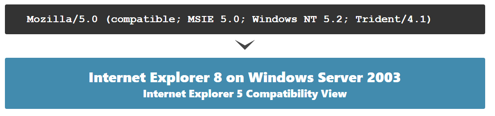

# CloutHaus: Social Media leads to Compromise

# Got Clout

## Question 1

Afomiya Storm is a rising social media influencer based in Washington, D.C. 🏙️ At 25, she’s already built a strong presence in the fashion and lifestyle industry

Known for her relatable "Get Ready With Me" videos, "Day in My Life" vlogs, and sponsored brand collaborations, Afomiya has captured the attention of a growing audience

Her Instagram profile is a curated window into her life - personal, engaging, and filled with content that her followers love. She also uses her personal email for business inquiries, making it easier for potential brand partners to contact her. However, this open approach might expose her to more risks than she realizes


**Based on Afomiya’s Instagram profile, what is the email address she uses for brand deals?**

> `Afomiya.storm@gmail.com`
> 

## Question 2

Afomiya’s Insta fame is skyrocketing, and now her inbox is basically a runway show of brand deals ✨ Makeup brands? Check. Fitness gear? Oh, absolutely. Her feed is looking like a dream

But with all the glitter and glam comes a darker side… suddenly, her inbox is like a game of ‘Is this a legit offer or a phishing trap?’ 😱 Time to put on her detective hat and sift through the good, the bad, and the suspicious!

**A.** The email contains urgent or threatening language, pressuring her to act quickly, such as "Immediate action required" or "Deadline in 24 hours."

**B.** The email asks for sensitive information like her `password`, `credit card details`, or `social security number`.

**C.** The email comes from a domain name that looks suspicious or doesn’t match the legitimate brand’s official domain.

**D.** The email has generic greetings like `"Dear Customer"` instead of addressing her by name or title.

**E.** All of the above.

**Which of the following signs should Afomiya look for to determine if an email offering a brand deal is a phishing attempt?**

> `E`
> 

## Question 3

Afomiya is engaging with her followers on Instagram and decides to do a Q&A session on her Instagram Stories. During the session, she answers some seemingly harmless questions.

However, a few of the questions posed by a follower are actually security questions used for her email and social media accounts.


**What technique is the threat actor using to manipulate her into revealing personal information that could compromise her email or Instagram account?**

> `Social Engineering`
> 

## Question 4

Using the info from Afomiya’s insta story Q&A, the attacker used the answers to bypass the security questions to attempt a password reset on her email account.

Security questions might seem like a good second layer of protection, but for attackers, they’re often easy pickings, especially in the age of social media

Answers to `“What’s your pet’s name?”` 🐶 or `“What city were you born in?”` 🌆 are often shared publicly or inadvertently revealed in Q&A posts 🙋, birthday shoutouts 🎂, or tagged photos 📸. That’s exactly how the attacker tried to exploit Afomiya.

This is called Open Source Intelligence `(OSINT)`, using publicly available info to gather intel on a target

Examine the screenshot of the authentication log and identify the answers the attacker submitted for the security questions.


**What answer did the attacker enter to try and bypass the security questions? Enter one of the answers the attacker submitted.**

> `Kidus`
> 

## Question 5

The threat actor is all geared up, thinking they’ve got Afomiya’s accounts in the bag 🎒 But when they try to reset her password, they hit a roadblock.

Even though they’ve got all the right answers, they can’t get past one tiny hurdle: the code sent to Afomiya’s phone 📱

No code, no access. The attacker’s frustration levels rise faster than Afomiya’s follower count, and they’re left staring at a screen, unable to break through that last layer of security 🤔

**What security measure saved Afomiya's email account from being hacked, despite the threat actor having access to her security question answers?**

> `MFA`
> 

## Question 6

Afomiya’s career is hitting new heights 👠 and her influence is so strong that CloutHaus, the brand management company working with top influencers, comes knocking at her door. “We see you,” they say, sliding into her inbox with an offer she can't resist 💌

Now, Afomiya’s part of a team that’s working with big time fashion and lifestyle brands, opening the door to all sorts of exciting collaborations 💫

Afomiya’s inbox just leveled up, now it’s part of the internal systems at CloutHaus. With big brands come big risks: impersonation, phishing, account takeovers. But CloutHaus is ready. Their internal systems log everything, from emails to network activity, in a powerful analytics platform called Azure Data Explorer (ADX).

**🧠 Let's go!**

From here on out, you’ll be using KQL (Kusto Query Language) to run queries that search through structured log data.

Here’s an example KQL query to find Afomiya's email from the Employees table:

```sql
Employees
| where name contains "afomiya"
```

You can read this like:➡️ Look in the Employees table, and filter for rows where the name field matches “Afomiya Storm”.

🔑 The result will show you Afomiya’s official CloutHaus email address, a key piece of info as you investigate future threats like phishing emails, email compromise, and unauthorized email forwarding.

You'll also spot other useful details in the results — like her username, role, IP address, and MFA status — which may come in handy as the investigation unfolds. 👀

**According to CloutHaus internal employee logs, what is Afomiya’s designated professional email?**

> `afomiya_storm@clouthaus.com`
> 

```json
"hire_date": 2024-10-10T00:00:00.000Z,
"name": Afomiya Storm,
"user_agent": Mozilla/5.0 (Windows NT 10.0; rv:51.0) Gecko/20100101 Firefox/51.0,
"ip_addr": 10.10.0.3,
"email_addr": afomiya_storm@clouthaus.com,
"username": afstorm,
"role": Influencer Partner,
"hostname": OQPA-DESKTOP,
"mfa_enabled": False,
"company_domain": clouthaus.com
```

## Question 7

Understanding employee roles helps identify who has access to what, who might be targeted, and how. Roles determine the systems, data, and privileges an employee interacts with, making them a key part of the attack surface.

Threat actors use this information during reconnaissance to choose high value targets, craft believable phishing lures, or impersonate trusted individuals.

For defenders, analyzing roles helps spot abnormal behavior, prioritize alerts, and better protect sensitive accounts 🛡️

Now let's determine Afomiya's role at CloutHaus. We can do this using the 'Employees' table.

```sql
Employees
| where name contains "first name"
| distinct role 
```

**What is Afomiya’s role with CloutHaus?**

> `Influencer Partner`
> 

## Question 8

🔐 Multi-Factor Authentication (MFA) is like a digital bouncer for your account, even if someone steals your password, they still need a second pass to get in. No code? No entry 🚫

For someone like Afomiya, a rising influencer at CloutHaus 🌟, MFA is a must-have. Public figures attract attention (the good kind and the hacker kind 👀), making them prime targets for phishing, password leaks, or account takeovers.

```sql
Employees
| where name contains "name"
| distinct mfa_enabled
```

**Based on the CloutHaus employee table, what is the status of Multi-Factor Authentication (MFA) for Afomiya’s account?**

> `False`
> 

```sql
Employees
| where name contains "afomiya" 
| distinct mfa_enabled
```

## Question 9

Afomiya’s brand game is on fire 🔥 and just when she thought things couldn’t get better, BAM, an email from Dior slides into her inbox. Dior. Yes, that Dior.

Her heart skips a beat as she reads about the new “exclusive” partnership. The email looks so legit, even her favorite influencer could be jealous

She’s imagining herself in couture gowns, sipping champagne, and living that influencer dream. With every sentence, she can practically hear the confetti pop 🎊 “This is it,” she thinks. “I’m about to sign a deal that will change my life!”

But wait… something’s… off

👀 The logo is crisp. The message is personalized. But the sender’s email address? That’s where things start to unravel.

Let's query our logs to find the email from Dior.

```sql
Email
| where recipient == "enter full email"
| where subject contains "enter keyword" or links contains "enter keyword"
```

**What is the sender’s email address in the email Afomiya received from "Dior"?**

> `collabs@dior-partners.com`
> 

```sql
Email
| where recipient == "afomiya_storm@clouthaus.com"
| where links contains "dior" or subject contains "dior"
```

```json
"timestamp": 2025-04-03T10:41:00.000Z,
"sender": collabs@dior-partners.com,
"reply_to": collabs@dior-partners.com,
"recipient": afomiya_storm@clouthaus.com,
"subject": [EXTERNAL] Exclusive Partnership Opportunity with Dior,
"verdict": CLEAN,
"links": [
	"https://super-brand-offer.com/login"
],
"attachments":
```

## Question 10

The subject line can say a lot about an email — sometimes it’s genuine, sometimes it’s just meant to grab attention. One message claimed to be from **“Dior”**, but looks can be deceiving.

Remember: corporate systems often add `[EXTERNAL]` to subject lines when a message comes from outside the organization. Personal inboxes like Gmail don’t add this, so if Afomiya saw this message in her brand email it might have been flagged, but in a personal account it would not.

**What is the subject line of the email Afomiya received from "Dior"?**

> `[EXTERNAL] Exclusive Partnership Opportunity with Dior`
> 

## Question 11

Links are where the drama unfolds. It’s all champagne and couture until you click a URL and end up on a hacker’s landing page

In threat intelligence and threat hunting, links are critical artifacts.

A malicious URL can reveal the attacker’s tactics, infrastructure, and sometimes even their identity

Let’s zoom in before we fall for the fashion fantasy

**What is the link provided in the email?**

> `https://super-brand-offer.com/login`
> 

## Question 12

Afomiya takes a deep breath and decides to take a look at the email headers and links. Something seems off, but she's still unsure.

The link in the email looks oddly familiar but doesn't exactly match the Dior website. Despite her hesitation, she clicks on the link, hoping it’s just a harmless mistake.

We can confirm that she clicked on the link by checking the outbound network traffic logs. Let's examine them closely to see if her click resulted in any suspicious outbound connections.

```sql
OutboundNetworkEvents
| where url contains "enter suspicious domain"
```

**When did Afomiya click on the link? Paste the entire timestamp.**

> `2025-04-03T11:20:02.000Z`
> 

```sql
OutboundNetworkEvents
| where url contains "super-brand" and src_ip == "10.10.0.3"
```

```json
"timestamp": 2025-04-03T11:20:00.000Z,
"method": GET,
"src_ip": 10.10.0.3,
"user_agent": Mozilla/5.0 (Windows NT 10.0; rv:51.0) Gecko/20100101 Firefox/51.0,
"url": https://super-brand-offer.com/login
```

## Question 13

She’s so excited, she doesn’t even think twice. The page looks clean, maybe too clean… but she’s already typing away. After all, Dior’s not gonna wait, right? 👀

This is a classic phishing tactic: clone a trusted login page to trick users into handing over credentials.

**What username did she enter?**

> `afstorm`
> 

```json
"timestamp": 2025-04-03T11:20:02.000Z,
"method": GET,
"src_ip": 10.10.0.3,
"user_agent": Mozilla/5.0 (Windows NT 10.0; rv:51.0) Gecko/20100101 Firefox/51.0,
"url": https://super-brand-offer.com/login?username=afstorm&password=**********
```

## Question 14

So Afomiya clicked the link (RIP judgment 🫠) because who wouldn’t trust a site called `super-brand-offer.com`? Sounds legit, right?

Now it’s time to pop on our digital detective hats and track down the shady IP address behind that suspicious domain.

Crack open the PassiveDNS logs like a cold brew on deadline day. let’s find out where this sketchy site actually lives and if it’s been hosting any other cyber nonsense on the side

```sql
PassiveDns
| where domain contains "enter suspicious domain"
```

**What is the IP address associated with the domain?**

> `198.51.100.12`
> 

```json
"timestamp": 2025-03-31T10:20:34.000Z,
"ip": 198.51.100.12,
"domain": super-brand-offer.com
```

## Question 15

Think of an IP address like a digital home address 🏠 if multiple shady domains are showing up at the same place, you might just have found a hacker hangout

Now that we’ve identified the IP address, let’s investigate further. Using the `PassiveDNS` logs, we can find all other domains associated with this IP address.

For threat hunters, this is huge. If a bunch of shady domains are tied to the same IP, that’s a big red flag 🚩 because it could be part of a malicious infrastructure, aka a hacker hangout.

Even if a bad domain is long gone, PassiveDNS remembers. That means you can uncover hidden connections and trace the web of attackers, one suspicious domain at a time 🔍🕸️

```sql
PassiveDns
| where ip contains "enter IP address"
| distinct domain
```

**How many distinct domains are linked to the suspicious IP address?**

> `3`
> 

```sql
PassiveDns
| where ip == "198.51.100.12"
| distinct domain
```

```json
super-brand-offer.com
dior-partners.com
influencer-deals.net
```

## Question 16

Afomiya’s Insta game was on point 💅from smoothie bowls to sunrise selfies, she shared it all. Her followers? Obsessed. The attacker? Even more obsessed… but for very different reasons

Turns out, every cute post and “just woke up like this” story was giving the attacker breadcrumbs to follow.

Because of her habit of reusing passwords (seriously, it’s been through more accounts than her favorite pair of sneakers), the attacker waltzed right into her Instagram.

Just like that, her carefully curated grid became ground zero for a cyber drama she definitely didn’t sign up for.

**Enter: I have MFA setup for my Instagram!**

> **`I have MFA setup for my Instagram!`**
> 

## Question 17

Afomiya’s Instagram account is hijacked, and the attacker immediately starts messaging her followers, asking for money and offering “exclusive investment opportunities,” because who wouldn’t want to invest in a micro-influencer, right?

Yeah, it goes down in the DMs, and her fans, trying to be supportive, happily send funds, thinking they’re helping their favorite influencer.

**What are the followers really investing in: `a great deal` or a `phishing scam`?**

> `phishing scam`
> 

## Question 18

But it doesn’t stop there! The attacker also responds to brand deals, claiming Afomiya’s apartment is perfect for package deliveries.

How does the attacker know the address? Easy… Afomiya’s Insta posts showed off her amazing apartment view 🌇, and using Open Source Intelligence (OSINT) techniques like reverse image search, the attacker pinpointed her exact location️️


**Based on the images showing the apartment view and amenities from Afomiya’s Instagram post, use a reverse image search to identify the name of the apartment building.**

> `The Apartments at CityCenter`
> 

## Question 19

And just to add salt to the wound, the attacker even got into her mailbox.

Why? Afomiya’s photo dump of her new place included a close-up of her keys. Oops!

This is a textbook case of **information leakage**, oversharing online in ways that hand attackers clues to bypass security.

<aside>
💡

Photos of keys can be analyzed or duplicated, leading to physical break-ins or mail theft.

Attackers often combine OSINT (open-source intelligence) with physical tactics to escalate their attacks.

How could this seemingly innocent post lead to a security risk?

👉 [Watch this video on the dangers of posting your keys online 🔐](https://www.youtube.com/watch?v=pohVT1nKZig)

</aside>

**ENTER: `Unlocking trouble with a photo!`**

## Question 20

Afomiya started spotting suspicious login attempts in her email 👀📧 — then noticed her Instagram acting strange too. Tough to catch when her DMs are a non-stop scrollathon , but something was definitely off.

She jumped into action:

- Changed her Insta password faster than an outfit change in a GRWM video
- Updated passwords across *all* her accounts (goodbye reused passwords )
- Activated multi-factor authentication to level up her security

This wasn’t just a reaction — it was resilience.

<aside>
💡

Why resilience matters?

Resilience means building habits that protect you *before* something bad happens:

- Strong, unique passwords
- MFA enabled everywhere
- Regular checks of login activity

Attackers rely on human behavior — reused passwords, ignoring alerts, oversharing.

But resilient users turn those weaknesses into strengths.

Think of it like digital self-defense: you’re not just dodging punches, you’re training so the attacker never lands a hit.

Cyber resilience is the glow-up your cyber hygiene routine needs

</aside>

**❓ What should you never reuse across different sites to protect your accounts?**

> `password`
> 

## Question 21

Afomiya sprang into action like a digital ninja 🥷 securing her accounts, changing passwords faster than you can say “phishing,” and letting her followers and brand partners know what went down. She learned that cyber villains don’t wait, so neither should she!

With her cybersecurity glow-up, Afomiya ditched bad habits (goodbye password reuse) and embraced the mighty powers of MFA and digital awareness

As she spread the word like a cyber fairy godmother she realized that staying safe online isn’t just a one-time fix, it’s a lifestyle. Now, she’s her own threat hunter, dodging red flags like a pro and keeping the cyber baddies at bay

**ENTER: Be the hunter, not the hunted!**

> `Be the hunter, not the hunted!`
> 

# Inside the Clout Breach

## Question 1

Okay team, things just got real. 😰

- 1 hour after Afomiya clicked a phishing link, someone logged into her company email.
- Different device. Different country. Using an ancient Internet Explorer build (yes, really).
- This isn’t casual snooping - it’s email compromise, recon, and possible data theft.

**Your mission:** use the Authentication, Network, and Email logs to uncover what the intruder did, what they wanted, and what may be gone. Be methodical. Document everything 🕵️‍♀️

**Start here:**

1. Find the suspicious login event.
2. Identify the IP address used to gain access.
3. Trace actions from that session (reads/sends, forwarding rules, downloads).

**What IP address was used to gain access?**

> `182.45.67.89`
> 

```sql
// Find the username first
Employees
| where username contains "storm"
```

```sql
// Then pull their login events:
// Also mentioned one hour after she clicked phishing link which occured during 4/3/2025, 11:20:00 AM

AuthenticationEvents
| where timestamp >= datetime(2025-04-03T12:19:11.000Z) and username == "afstorm"
```

```json
"timestamp": 2025-04-03T12:20:00.000Z,
"hostname": MAIL-SERVER01,
"src_ip": 182.45.67.89,
"user_agent": Mozilla/5.0 (compatible; MSIE 5.0; Windows NT 5.2; Trident/4.1),
"username": afstorm,
"result": Successful Login,
"password_hash": a2feaddef8e617fa9cf861b3b49b1dd5,
"description": User successfully logged into their email account.
```

## Question 2

🌐 Time to Dig Deeper on That Suspicious IP

You found the IP address used in the unusual login to Afomiya’s email, now let’s see what else it’s connected to.

Attackers often reuse the same servers for phishing, malware, or command-and-control. Pivoting from an IP to its domains helps you map infrastructure and spot other malicious activity.

**👉 What domains are associated with this IP? (enter one)**

> `influencer-deals.net`
> 

```sql
PassiveDns
| where ip == '182.45.67.89'
| distinct domain
```

```json
influencer-deals.net
dior-partners.com
```

## Question 3

That login used a browser so ancient it probably plays Snake natively 🐍

Attackers love outdated User-Agents because they can mimic real users or slip past detections.

**👉 What part of the User-Agent string indicates the suspicious browser and operating system? (Submit either the browser name/version or the operating system name/version.)**

> **`MSIE 5.0`**
> 



## Question 4

IP addresses can reveal a lot, even the city where a login originated📍

Geolocation helps spot anomalies, like logins from unexpected regions.

And let’s be real: Afomiya’s not flying around doing brand shoots overseas. If this login came from across the world, that’s a 🚩

| IP Address | Location | Network |
| --- | --- | --- |
| 182.45.67.89 | Jinan, Shandong, China (CN), Asia | 182.45.0.0/17
 |

<aside>
💡

- **Why it matters:** IP geolocation can expose impossible travel, unusual logins, or attacker infrastructure.
- **MaxMind** is a common service that maps IPs to countries/cities:🔗 [MaxMind GeoIP Demo](https://www.maxmind.com/en/geoip-demo)
- Many SIEMs or log sources already enrich logs with this data.

Pro tip: look for mismatches — if a user logs in from New York at 9AM and then from Moscow at 9:05AM, something’s off.

</aside>

**What country did the login originate from?**

> `China`
> 


## Question 5

Creepy Recon Is Still Recon…🫣

Before launching further attacks, adversaries often snoop around to collect personal or company info. That’s called reconnaissance, and this one’s doing it in a very stalkery way.

The `InboundNetworkEvents` table is a goldmine for early warning signs. It logs incoming activity to the company’s site 🌐 that can reveal reconnaissance behavior 🔍 before an attacker makes their move 🚨

Understanding this table helps analysts connect the dots between suspicious access patterns, search behavior, and potential targets, a key skill for stopping threats in their tracks.

**According to the attacker's web search history on the site, what were they trying to hack?**

> `location`
> 

```sql
InboundNetworkEvents
| where  src_ip == '182.45.67.89' and url contains "hack"
| distinct url 
```

```sql
https://clouthaus.com/search=How+to+hack+an+influencer's+location+from+their+Instagram+story
```

## Question 6

When an attacker searches for a person’s private information “for a friend,” it's not friendly. It's targeted recon 🎯

This kind of activity is known as open-source intelligence (OSINT), and it’s a common early move in the attack chain. By pretending to be a curious outsider, threat actors can gather personal details they’ll later weaponize for phishing, social engineering, or account compromise.

**According to another search log, what kind of personal info were they sneakily trying to uncover (and pretending to ask “for a friend”)?**

> `home address`
> 

```sql
InboundNetworkEvents
| where  src_ip == '182.45.67.89' and url contains "friend"
| distinct url 
```

```sql
https://clouthaus.com/search=Afomiya+Storm+home+address??+(asking+for+a+friend)
https://clouthaus.com/search=Does+Afomiya+Storm+have+a+secret+boyfriend+or+what?
https://clouthaus.com/search=How+to+fake+an+influencer+friendship+online+(no+judgment)
```

## Question 7

Payment platforms can expose transaction histories, usernames, and personal details if not set to private. For threat actors, these sites are goldmines, they reveal who you pay, when, why, and sometimes where. One log shows the attacker was snooping in Afomiya’s transaction history. That’s not curiosity, it’s targeted profiling.

> `venmo`
> 

```sql
InboundNetworkEvents
| where src_ip contains "182.45.67.89"
| where url has_any ("venmo", "paypal", "cashapp", "stripe", "bank")
```

## Question 8

Attackers sometimes lure targets into fake jobs, events, or gigs. It’s social engineering with a sprinkle of glitter and a whole lot of malicious intent 🎭

These tactics are often used in spear phishing campaigns or physical reconnaissance. Fake invites can be crafted to steal credentials, deploy spyware, or even get the target to show up somewhere unsafe 💌📬 It’s the kind of scam that blends Open Source Intelligence (OSINT) with emotional manipulation.

Event-based lures are especially effective with influencers or public figures, who often rely on partnerships and appearances for work. That trust? It’s what the attacker exploits.

**Based on another search, what shady and fake event were they pretending to plan as a way to lure Afomiya?**

> `birthday party`
> 

```sql
InboundNetworkEvents
| where  src_ip == '182.45.67.89' and url contains "fake"
| distinct url 
```

```sql
https://clouthaus.com/search=How+to+fake+an+influencer+friendship+online+(no+judgment)
https://clouthaus.com/search=How+much+would+it+cost+to+hire+Afomiya+for+a+fake+birthday+party?
```

## Question 9

When attackers gain access to email, they often auto-forward sensitive messages to themselves. That’s exfiltration, baby. 📧

This tactic is stealthy and persistent, attackers don’t even need to log back in. It’s common in:

- **Business Email Compromise (BEC):** stealing money or sensitive info 💼
- **Espionage campaigns:** spying for secrets 🕵️
- **Advanced Persistent Threats (APTs):** long-term, targeted attacks 🎯

Auto-forwarding rules often slip past investigations, quietly sending out documents, invoices, or even MFA reset links.

**❓ What external email address received messages forwarded from Afomiya’s account?**

> `noreply@influencer-deals.net`
> 

```sql
Email
| where sender == "afomiya_storm@clouthaus.com"
| where subject has_any ("FW:", "Fwd:", "[FORWARD]") and recipient !contains "clouthaus"
| summarize count() by recipient
| sort by count_ desc
```

## Question 10

When attackers pop an inbox, they don’t just lurk, they exfiltrate. Sensitive attachments (payroll, passports, forms) are a goldmine for identity theft and social engineering 🕵️‍♂️

Direct deposit forms are especially dangerous: full name, bank account, routing number - everything needed for rerouting funds or impersonation. 🤑

In BEC/APT cases, intruders search for financial docs, then forward or download them to use in fraud or lateral movement.

📬 Pro tip: right after compromise, watch for new forwarding rules, large attachment downloads, or mailbox exports.

**❓ Which forwarded email contained Afomiya’s payment details or direct deposit form?**

> `[EXTERNAL] [FORWARD] Afomiya's payment details – direct deposit form`
> 

```sql
Email
| where sender == "afomiya_storm@clouthaus.com"
| where subject has_any ("payment", "deposit")
| project-keep subject
```

## Question 11

A stolen passport scan can give an attacker everything they need for identity theft, account takeovers, and even travel fraud.

**What forwarded email subject included a passport scan?**

*(Submit the exact subject line.)*

> `[EXTERNAL] [FORWARD] Afomiya's passport scan – confidential`
> 

```sql
Email
| where sender == "afomiya_storm@clouthaus.com"
| where subject has_any ("passport")
| project-keep subject
```

## Question 12

Tax forms and bank statements expose full names, addresses, income, and account numbers - sensitive data gold. 🍦🏅 With this, attackers can commit fraud, file fake returns, or stage targeted takeovers.

**❓ Which forwarded email subject contained either Afomiya’s bank statement or year-end tax documents?**

*(Submit the exact subject line.)*

> `[EXTERNAL] [FORWARD] Re: Re: Re: Afomiya's bank statement – confidential`
> 

## Question 13

By now, you've uncovered suspicious logins 🕵️‍♀️, sneaky searches 🔍, data grabs so bold they deserve an award 🏆, and email forwards shadier than your ex’s explanations 📤😒. But step back for a second…

**Based on everything you’ve discovered, what do you think the attacker’s true objective was?**

