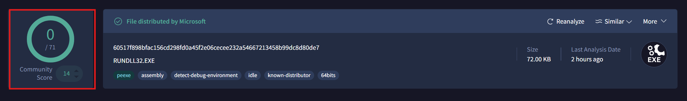

# VirusTotal Fundamentals

# VIRUSTOTAL 101

## Question 1

**VirusTotal** is a website that scans files, webpages, domains, and IPs, against a large number of antivirus scanners. This allows a user to get feedback from a large number of sources and helps them determine if something is known to be malicious or known to be benign.

Files and URLs can be uploaded to VirusTotal. ⚠️**However, once they are uploaded, they should be considered public.**⚠️

Organizations that pay for access can download uploaded files. As a result, do not upload sensitive files or files that belong to your employer.

**To finish this question, type `upload with care`.**

> **`upload with care`**
> 

## Question 2

Open [VirusTotal.com](https://www.virustotal.com/) in another tab.

While VirusTotal can be used without being logged in, we highly recommend creating a free account and logging in.

The following questions will demonstrate some of the benefits of being logged in.

[You can register for an account here](https://www.virustotal.com/gui/join-us).

**To complete this question, create a free VirusTotal account, then type and submit `Ready to go`.**

> **`Ready to go`**
> 

## Question 3

It is common for analysts to use VirusTotal to inspect malicious files, but it is also critical for recognizing benign files.

At VirusTotal, perform a lookup for the following filehash by selecting `Search` and entering the hash `60517f898bfac156cd298fd0a45f2e06cecee232a54667213458b99dc8d80de7` and pressing enter.

In the header, VirusTotal provides a summary about the file.

In the top left, is a detection ratio: the number is the number of detections as malicious out of the total number of detection engines.

**How many detection engines flagged this file?**

> `0`
> 

## Question 4

The header also contains the `SHA256` hash of the file and a name for the file. VirusTotal calls this the "meaningful name". VirusTotal may pull it from the file's `original name`, `internal name` of the file, or the name may be the name of the first file with this hash that was uploaded. As a result, the name in the header may differ from the name of the file that was uploaded.

VirusTotal will also tag the file with key indicators below the file name.

One important tag to be familiar with is `known-distributor`. This tag is used for files that are provided to VirusTotal by a reliable source. During an investigation, if you start investigating a file with the `known-distributor` tag, there are a few possible scenarios:

**First:**

Perhaps you grabbed the wrong file hash. That is, sometimes a legitimate file is executing or loading a malicious one and security tools will often share the hash of the executing process. In this case, double-check the file hash.

**Who is the distributor of this file?**

> `Microsoft`
> 

## Question 5

Second: 

Perhaps the legitimate file was renamed. This technique is called `masquerading`. This is a common technique of attackers to avoid detections which may look for a specific process name.

MITRE ATT&CK is a catalog of cyber attacks and has an entry for this technique.

You can find the list of MITRE ATT&CK techniques at [attack.mitre.org](https://attack.mitre.org/).

**What is the MITRE ATT&CK Technique ID for masquerading?**

> `T1036`
> 

## Question 6

**Third:**

Perhaps the legitimate file is being used in a malicious manner. One example is `DLL Search Order Hijacking`. A DLL is code that can be shared by multiple programs and this technique tricks a file to load something malicious instead of the normal code by renaming a malicious file to have the same name as a benign DLL.

**What is the MITRE ATT&CK Technique ID for DLL Search Order Hijacking?**

> `T1574.001`
> 

## Question 7

**Fourth:**

It is rare, but it is also possible that the supplier has been compromised and is unknowingly distributing malicious files.

In 2023, a creator of Voice Over IP (`VOIP`) phones and software was found to be compromised and used to distribute malicious files.

**What was the name of the affected company?**

> `3CX`
> 

## Question 8

On the right side of the header, we see other details such as the file size, `Last Modification Date`, and file type.

**What is the file type of this file?**

> `.exe`
> 

## Question 9

The `Last Modification Date` refers to the last time the report was last updated. This matches the `Last Analysis Date` in another part of the report. You should always think of this date in the header as the last time the file was analyzed.

Users can manually trigger the file to be analyzed again by using the `Reanalyze` button above the last modification date.

Next to the Reanalyze button are two other buttons, `Similar` and `More`. Unfortunately, these options are not available to us with a free account. These options require subscriptions and cost a boat-load of money. However, we won't let that stop us from learning. We'll keep on analyzing.

**To finish this question, type `Nothing can hold me back`**.

> **`Nothing can hold me back`**
> 

## Question 10

Reanalyzing files is important in two situations:

First, the file appears to be old. Perhaps the file was uploaded to VirusTotal several years ago and the last analysis was also years ago. Reanalyzing the file will process the file again against new detections that may have become available since the time that the file was previously analyzed.

Second, the file may be very new. It is common with emerging threats that detections may not exist and VirusTotal may present the user with a low score (less than 10 detections) or even a clean score (0 detections). Reanalyzing the file will check the file against the detection engines again.

**Let's move over to the `Details` tab.**

In the `Details` tab, under the `History` section, you can see the Last `Analysis date`.

The `First Submission` date is for when the file was first uploaded to VirusTotal.

**To complete this question, provide the whole timestamp for the `First Submission`.**

> `2021-06-18 09:31:41 UTC`
> 

## Question 11

The `Creation time` is based on the file's metadata.

Malware developers can change this date and sometimes, a weird date can be a suspicious indicator, but not always. Some types of files even default to having a certain date.

Microsoft sets funky dates intentionally for their files. They do this so that they can build files with a consistent file hash. More can be read about that [on their blog](https://devblogs.microsoft.com/oldnewthing/20180103-00/?p=97705).

**Submit the file's creation time to complete this question.**

> 
> 
> 
> `2040-03-02 02:49:27 UTC`
> 

## Question 12

No one really knows what the `First seen in the Wild` date means. VirusTotal doesn't explain it anywhere and the timestamp doesn't make sense consistently. Don't put much trust into it.

The last analysis date here is useful as it helps us know how long ago the file has been analyzed in contrast to the first submission.

The `Last Submission` date indicates the last time the file was uploaded. If something is new and being seen by many people, you can see the `Last Submission` get updated each time you refresh.

Another indication of users uploading the same file is the `Names` section, which is just below the `History` section.

The `Names` are the names of the files that have been uploaded.

One of the uploads is `rKpPlCbFgHgAfYwYlYjWu` a seemingly random name. (More and more keep getting uploaded causing problems with this question, but the important thing is that you know where to find these names.)

*Enter `rKpPlCbFgHgAfYwYlYjWu` to complete this question.*

> `*rKpPlCbFgHgAfYwYlYjWu`*
> 

## Question 13

Why might someone have uploaded a legitimate file with a wacky name like that?

**Enter the name of the technique to complete this question.**

> `Masquerading`
> 

## Question 14

As you may have concluded already: changing the name of a file doesn’t affect its file hash. The file hash will stay the same no matter what the file is named.

In this case, the list of `Names` is pretty long. `rundll32` commonly gets abused, so it is important to be careful: that is, you don’t want to set security tools to block or alert a file named `rKpPlCbFgHgAfYwYlYjWu` just to find out that you blocked a legitimate Windows application! Blocking a legitimate file could cause an outage for users or for a whole enterprise.

**To complete this question, type `Do not block!`**

> **`Do not block!`**
> 

## Question 15

Above the `History` section is a `Basic Properties` section. This section contains a variety of file hash types. If you ever need an `MD5` or `SHA-1` hash, this is a good place to find it. The other hashes may become useful to you as you get familiar with other hash types.

This section also provides more detail on the file type. This can be useful if the file type isn’t completely clear or if you need to know more nuanced details about the file type.

**To complete this question, enter the version number of the C/C++ compiler according to the details in the *Basic Properties* section.**

> `19.28.29395`
> 

# VIRUSTOTAL 102

## Question 1

Below the `Names` section, there is an optional `Signature Info` section.

Developers can digitally sign files as evidence the file came from them. The signature contains a hash of the file so that if the file is modified in any way, the signature will flag as `Invalid` indicating that the file has been tampered with.

Microsoft often signs their files, but not always. As a result, the signature can be an unreliable source of truth as to if the file is from Microsoft or not.

**To complete this question type `You do you, Microsoft`.**

> **`You do you, Microsoft`**
> 

## Question 2

In order to sign a file, a company needs to "prove" to a certificate issuer that they are a legitimate company.

This system can be abused, so it is important to take a look at the company in the certificate and determine if it makes sense with everything else you know about the file.

The file is then signed by the developer and then signed by the certificate issuer. The developer's name is usually listed first.

Take a look at the first signer of the file with the hash: `4788925332fc6128c895b0e0736a1d7d90e3891f2abb456523cbf0c1ced7d1e2`.

(Search for that hash, and look in the `Details` tab.)

**Does that company make sense to be providing software? To complete this question, enter the name of the first signer for the file hash.**

> `Heart Craft Brewery s. r. o.`
> 

## Question 3

In the `Signature Info` section, the `File Version Information` is extracted from the file itself. The copyright, product, description, original name, and other details are all controlled by the creator of the file. Since they are controlled by the creator, they should only be trusted if you trust the file.

Look at the File version information for the following file: `549ff37e56d372d076a3d11cd33af660568dc1048b1f4ecce77d8b334582c6c8`.

At the time of this writing, the last time the file was analyzed was a year ago, and the certificate appears valid. The file only had 2/70 detections. According to the file, the copyright belongs to `Intel Corporation`.

**But who is the first signer?**

> `M-Trans Maciej Caban`
> 

## Question 4

A fellow SOC analyst informed us that they found a sample with the same Certificate signer as in question 3! The file hash is `a50bcbf0ef744f6b7780685cfd2f41a13be4c921d4b401384efd85c6109d7c00`, however, it has a lot more hits by detection engines!

Let's look at the `Detections` tab.

**There are a few sections of this page that are only visible if you are logged in.** These sections are `Crowdsourced YARA rules` and `Crowdsourced Sigma Rules`. It is beyond the purpose of this lesson to discuss YARA rules and Sigma rules, but the important thing right now is knowing that VirusTotal users can contribute custom rules. You are also able to view these rules by hovering over the rule and clicking `View Ruleset`. This is useful if you want to understand why the rule fired or if you want to use the rule elsewhere.

**One of the YARA rules identified that the file included encrypted content. What is the name of the rule?**

> `INDICATOR_EXE_DotNET_Encrypted`
> 

## Question 5

The largest section on the page is the `Security vendors’ analysis`. This section shows the results from many different security vendors. The number of vendors who detected something malicious contributes to the detection ratio in the header.

Newer analysts can sometimes make a mistake of assuming something is malicious because it has some detections, but it is good to understand who is detecting what. No vendor is perfect, but there are definitely some vendors who are more reliable and well known than others.

Sometimes, directly above this section, there is a bar that summarizes some of the detections. This includes a **Popular threat label** and a summary of tags.

**What is the `popular threat label` for `a50bcbf0ef744f6b7780685cfd2f41a13be4c921d4b401384efd85c6109d7c00`?**

> `trojan.msil/stealer`
> 

## Question 6

That label suggests the file is a **Trojan** and **Stealer** (also known as **Information Stealing malware**) which may steal passwords from the computer and browser.

The community tab can often help us learn more.

Let's go to the `community` tab. **Make sure you are logged into your account.** You will see a section called `Contained in Collections` or `Contained in Graphs`.

VirusTotal allows users to group common files and indicators together in a collection or graph. According to this page, some users have a collection/graph that contains this file. By looking at those, or the information associated with them, we can learn more about the file

**According to some of the `Contained in Collections` groups and the comments, what threat actor used this file?**

> `Juice ledger`
> 

## Question 7

The `Comments` section contains information submitted by registered users and can often help an investigation substantially. We can use information we find here and see if it matches the behavior in our investigation.

Let's look at a new file: the file hash is `a54ca708c3bbef76dbaec817a9bb36d8b52e492b293d2127cd5be284caabb6d1`.

The file has a low detection ratio: `7/62` at the time of this writing. (*Note: this ratio may change as more vendors either scan or detect this file*).

Just looking at the numbers, this ratio is inconclusive as to whether the file is malicious or not. However, if we look at the `Community` tab and the `Comments` section, we see a helpful comment from **colinc_sophos**.

**What malware does colinc_sophos claim this file is?**

> `Batloader`
> 

## Question 8

**Be careful: threat actors leave comments too!**

Previously, this malware had a comment from a threat actor stating that it was `Clean`! The threat actor has now been banned from VirusTotal and their comments removed.

In that situation, colinc left robust comments on all the same files that the threat actor had commented on. colinc was able to do this because you can see all of someone's comments by clicking on their profile image.

Looking at someone's profile can help you understand how reliable someone is and it may also help you find related malware.

After clicking on their image, the profile header has their username and their name.

**What is the name of the user posting as colinc_sophos?**

> `Colin Cowie`
> 

## Question 9

This file has a low score because of anti-analysis techniques and because it can no longer retrieve its malicious payloads. As a result, most of the behavior is unavailable to the sandboxes and from the detection engines.

As a result, comments like those left by colinc_sophos can help provide context that VirusTotal itself does not provide.

When you analyze files in the future, consider leaving comments for others who may investigate the same file as you. You can also vote using the `Community Score` buttons under the detection ratio. The 🢓 will downvote, and the 𝧶 will upvote.

**According to colinc_sophos, how is this malware distributed?**

> `fake software websites & malvertizing`
> 

## Question 10

MITRE ATT&CK describes the technique from the last question like this:

*"Adversaries may purchase online advertisements that can be abused to distribute malware to victims. Ads can be purchased to plant as well as favorably position artifacts in specific locations online, such as prominently placed within search engine results. These ads may make it more difficult for users to distinguish between actual search results and advertisements. Purchased ads may also target specific audiences using the advertising network’s capabilities, potentially further taking advantage of the trust inherently given to search engines and popular websites."*

**What is the MITRE ATT&CK technique ID for this technique?**

> `T1583.008`
> 

## Question 11

Another SOC analyst contacted us to let us know they found *yet another* file with the same Certificate signer as in Question 3, but its behavior is different. This file has the file hash `0221bf1e1bd171c17527a863531518a95bcc025c87888e66b9512a5651073d16`. Let's take a look at it.

Oh dear! This file has even more detections than the last one.

Based on the header, someone appears to have uploaded the file with a name that includes the file hash.

Was the file uploaded with another name? (Hint: it was)

**To complete this question, provide the other file name.**

> `IRS_form_Package_17-01-2023_19-25-53.exe`
> 

## Question 12

Based on the `Comments` tab for the same file in Question 11, what malware family is this file?

**Enter the malware family name to complete this question**

> `icedid`
> 

## Question 13

Let's look at the `Relations tab` for the same file from the last two questions. In this tab, we will see information such as what domains and IP addresses a file connects to.

**According to the relations tab, what domain was contacted by this file?**

> 
> 
> 
> `plivetrakoy.com`
> 

## Question 14

The `Relations` tab is a great place to pivot on suspicious indicators.

To **“pivot”** is to take an indicator and use it to turn in a new direction. This can help find new indicators and can help find related files. To pivot on the domain, click the domain that you found in the last question. Clicking the domain will navigate to the VirusTotal page for that domain.

Up until this point, we have only looked at file analysis in VirusTotal, but VirusTotal also has analysis for domains and IP addressess.

The `Details` page is consistent with what you might expect for a domain, such as details about DNS Records. We will not dig into these details for this lesson, but it is good to know they are here.

If we look at the `Relations` tab, we can see a section called `Passive DNS Replication`. These are the IP addresses that had resolved to the suspicious domain.

**What IP address resolved to this domain on the date closest to when the file was submitted to VirusTotal?**

> 
> 
> 
> `193.149.180.175`
> 

<aside>
💡

Compare to the First Submission Date of the file i.e.

2023-01-18 20:17:59 UTC

</aside>

## Question 15

Pivoting gives you as an analyst more information to search on. You can also leverage this information to identify if hosts in the environment have indicators you found while pivoting. Originally, we only had a filehash, but now we have a filehash, a domain, and an IP address.

While on the VirusTotal page for the domain, we can look at the `Communicating Files` section on the `Relations` tab. This section can be useful when you don’t know if an IP address is being used maliciously or not.

In this case, there are 5 files uploaded to VirusTotal which communicate with this IP address, and one of them is the file we saw previously.

**What is the general disposition of the files? Answer with one of the following: `The files look OK` , `Mixed Results`, or `All bad`**

> `All bad`
> 

## Question 16

Let's return to the previous file. We can do this by clicking the filename in the `Communicating Files` section or by searching for the file hash `0221bf1e1bd171c17527a863531518a95bcc025c87888e66b9512a5651073d16` again.

Returning to the `Relations` tab:

We also see a section called `Execution Parents`. This section exists when a file was dropped by another during analysis. This can give us some clues as to where the file came from. In this case, it looks like it came from a ZIP file.

**What is the name of this file’s execution parent?**

> 
> 
> 
> `IRS_form_Package_17-01-2023_19-25-53 (1).zip`
> 

## Question 17

If we click the file name of the execution parent, we can pivot to that file. This file is a ZIP file.

Any ZIP file uploaded to VirusTotal will be extracted and the contents will be submitted for their own analysis. This is important to know in case other files in the ZIP are necessary for the malicious file to execute. That is not the case in this situation: it appears the ZIP file only has 1 file inside of it based off of the `Relations` tab.

**To complete this question, provide the SHA-1 hash for the ZIP file.**

> `85d1e350486fea5945f46842685f248340fbf7dc`
> 

# VIRUSTOTAL 103

## Question 1

While we were working, our Threat Intel team informed us they found yet another file with the same certificate signer! The Intel team informs us that criminals impersonate companies to get certificates and then sell the certificates to sign the malware for multiple malware developers!

The hash of the file is `2bf0a64fe7aea262c96fc7d52b1e28486ff607caa9513fd88583e19454f9c500`.

**What is the status of the certificate of this file?**

> `A certificate was explicitly revoked by its issuer.`
> 

## Question 2

**What is the `Creation Time` for this file?**

> `1992-06-19 22:22:17 UTC`
> 

## Question 3

The creation time for this file is actually normal for this type of file. Every file made with this compiler version has the same timestamp.

**What is the name of the compiler of this file?**

> `borland delphi`
> 

## Question 4

A user reported a command-and-control (C2) server in the comments section. If we look, we won't see this C2 IP address in the relations tab.

If we trust this user, we could investigate this IP in our own investigation.

**What is the `name` of the DLL file which was observed connecting to this IP address on 2025-02-12?**

> `WABCDEFGHIJKLMNOPQRSTUVWXYZABCDEFGHIJKLMNOPQRSTUVWXYZoYDHNFTTPDJL50NWXNEWCHBUDCPJOeEZNbd`
> 

## Question 5

Let's look back to the file from questions 1-3. We will now look at the `Behavior` tab to understand what this file does.

`2bf0a64fe7aea262c96fc7d52b1e28486ff607caa9513fd88583e19454f9c500`

At the top of the `Behavior` tab, it will list any sandboxes that were used to analyze the file. At the time of writing this, the only sandbox in this instance is `DrWeb vxCube`.

There are often more sandbox reports, but there may only be one sandbox due to the file's large size. Many sandboxes cannot handle sizes larger than 100MB and the maximum size that can be uploaded to VirusTotal is 650MB.

**What is the file's size?**

> `301.35 MB`
> 

## Question 6

Attackers are aware of these size limitations and `pump` or `inflate` their files to be too large for sandbox analysis.

Defenders can defeat this technique by `deflating` the file. One tool that does this is called `Debloat`.

A deflated copy of this file was uploaded to VirusTotal: `71d5a558096b640366dbc711ef2870c0269b4138352bb98da0be30d9b6d6bb9b`. When uploaded, it was able to be analyzed with 5 sandboxes this time.

**What is the size of the deflated file?**

> 
> 
> 
> `2.52 MB`
> 

## Question 7

Let's return to the inflated file from question 5 and look back to the `Behavior` tab. When we look at the report, we can learn a lot about what the file did.

`2bf0a64fe7aea262c96fc7d52b1e28486ff607caa9513fd88583e19454f9c500`

`File system actions` records any files `opened`, `written`, or `dropped` by the file. During the analysis, a file was written in an important file path. Any file in this file path will be executed when the user logs onto the device.

**To complete this question, provide the full filepath. (Note: leave the filename off as it may change if this file is re-analyzed.)**

> `%APPDATA%\microsoft\windows\start menu\programs\startup\`
> 

## Question 8

Below the `File system actions` section is a section called `Registry actions`. On a Windows machine, the Registry is responsible for the device's configuration and the Registry handles many aspects of the computer.

When this file executed, it modified some registry keys. Registry keys are separated into `hives` and the `hive` associated with the registry key is listed at the beginning of the key. The `registry hive` modified by the malware is abbreviated `HKCU`.

**What is the full name of the `registry hive`?**

> `HKEY_CURRENT_USER`
> 

## Question 9

VirusTotal records what is written in the registry keys when they are modified. To view the contents, click the **+** to the left of the registry key.

One of the keys contains the path `shell\open\command`.

**What program will the registry key execute when called? This is the first word written to the registry key.**

> `powershell`
> 

## Question 10

A lot of content was written to the registry key including something about `Cryptography`?

**What type of encryption algorithm is mentioned and used by the registry key?**

> `AES`
> 

## Question 11

Below the `Registry actions` section is a section called `Process and service actions`. One of the categories here is `Process tree`.

A `Process tree` shows the relation between executed files. If a process spawns another process, the first process is called a `parent process` and the second is called a `child process`.

`Child Processes` are indicated here with an arrow curving to the right.

**What is the `child process` of our file?**

> `powershell.exe`
> 

